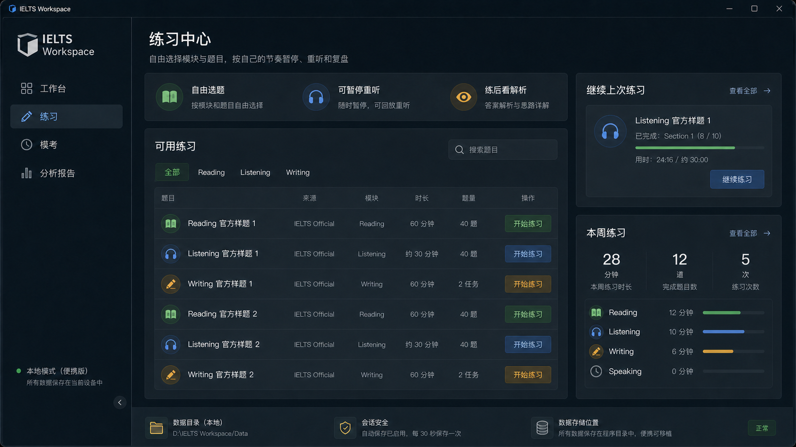

<div align="center">


# IELTS Workspace

### 🎯 本地优先的高保真雅思机考（IELTS on Computer）备考与全真模考桌面工作台

<p align="center">
  <a href="https://github.com/lingcang728/IELTS-Workspace/releases/latest"></a>
  
  
  
  
  <a href="https://github.com/lingcang728/IELTS-Workspace/stargazers"></a>
</p>

<p align="center">
  <b>1:1 深度还原官方机考真实交互行为 • 剑桥雅思真题全覆盖 • 纯本地离线运行 • 零广告 • 零隐私泄露</b>
</p>

---

[✨ 特性亮点](#-特性亮点) • [🖥️ 界面预览](#-界面预览) • [📥 快速下载](#-快速下载与安装) • [🚀 快速上手](#-快速上手) • [🛠️ 源码构建](#-本地开发与构建) • [🏗️ 技术架构](#-技术架构) • [📄 版权说明](#-免责与版权声明)

</div>

<br />

## 💡 为什么选择 IELTS Workspace？

在准备雅思机考（IELTS on Computer）时，许多考生常常受困于以下痛点：
- **考场适应困难**：传统备考网站或 App 界面样式与真实机考系统出入极大，无法有效建立答题肌肉记忆（如底部导航栏标记、划线与便签联动、左右分栏独立滚动等）。
- **流程不真实**：很多练习平台允许听力随意快进、倒带或反复重听，缺乏真实机考中“音频仅放一次 + 严格时间联动”的紧迫感。
- **网络与广告干扰**：在线刷题平台充斥广告弹窗与网络波动，甚至需强制登录与高昂订阅费。
- **隐私与数据丢失**：作答记录和笔记全保存在云端第三方服务器，无法自主备份和完全拥有自己的学习资产。

**IELTS Workspace** 由个人开发者独立打造，致力于解决上述所有痛点——以 **“极致考场还原”** 与 **“本地优先（Local-First）”** 为核心原则，为每一位雅思考生提供纯粹、专业、稳定、可信赖的现代化机考备考工作台。

---

## ✨ 特性亮点

### 🎯 1:1 深度还原官方机考交互（Official Exam Runtime）
- **🎧 听力（Listening）考场仿真**：
  - 严格遵循官方机考逻辑：音频**仅播放一次**，播放期间不可随意暂停与拖动。
  - 音频与答题计时器深度协同，听力结束后自动进入官方专属 **2 分钟全卷检查倒计时**。
- **📖 阅读（Reading）双栏交互**：
  - 左侧文章、右侧题目独立双滚动条设计，互不干扰。
  - 支持 **划词即时高亮（Highlight）** 与 **关联便签笔记（Notes）**，操作习惯与机考完全一致。
- **✍️ 写作（Writing）考场环境**：
  - Task 1 与 Task 2 双任务自由切换作答，实时**字数统计（Word Count）**。
  - 主动禁用浏览器拼写纠错（Spellcheck）与自动修正，杜绝考前产生依赖。
- **⏱️ 考场全局状态与提醒**：
  - 顶部官方风格倒计时，考试剩余 10 分钟与 5 分钟时触发**红字闪烁强提醒**，时间用尽强制交卷。
  - 底部 40 题全景导航条，清晰指示「已作答（横线标识）」、「未作答」、「标疑（Review Flag 圆形标识）」状态。

### 📚 剑桥雅思全真题库开箱即用（Cambridge IELTS 4–20+）
- 全面覆盖剑桥雅思官方真题集，内置结构化真题数据、原版高清听力音频与教材文档。
- 完整支持雅思机考全题型：单选、多选、填空（Summary/Sentence/Table/Flow-chart）、配对（Matching/Headings）、判断（TRUE/FALSE/NOT GIVEN, YES/NO/NOT GIVEN）等。

### ⚡ 双模式智能备考（Practice & Mock）
- **专项练习模式（Practice）**：适合日常精练，支持随时暂停、回放音频、即时查看参考答案与解析。
- **全真模考模式（Mock）**：完全锁定考场规则，严格计时，还原全真考场压力与流程。

### 📊 智能考后复盘与能力雷达
- 模考结束后即时生成全卷评估报告，自动换算雅思标准 9 分制得分（Band Score）。
- 题型得分率分布、各 Part 耗时分析、错题快速定位与历史作答回溯。

### 🔒 本地优先与零隐私泄露（Local-First & Zero-Telemetry）
- **100% 离线运行**：无需注册账号、无需联网登录、无任何后台埋点与数据收集。
- **数据完全自主**：所有练习记录、模考成绩、高亮笔记均以标准格式保存在本地，随时可备份迁移。

---

## 🖥️ 界面预览

<div align="center">
  
  <p><i>▲ IELTS Workspace 练习中心 — 题库选择、模块练习与真题管理</i></p>
</div>

---

## 📥 快速下载与安装

### 方式一：直接下载安装包（推荐）

前往 [GitHub Releases 最新发布页](https://github.com/lingcang728/IELTS-Workspace/releases/latest) 下载对应版本：

| 版本类型 | 文件名 | 说明 |
| :--- | :--- | :--- |
| **📦 Windows 安装版** | `IELTS_Workspace_1.0.0_x64_setup.exe` | 推荐普通用户使用，一键安装并自动创建桌面快捷方式 |
| **🚀 Windows 便携绿色版** | `IELTS_Workspace_1.0.0_windows_x64_portable.zip` | 解压即用，适合放在 U 盘或移动硬盘中随身携带 |

> **支持系统**：Windows 10 / Windows 11 (64-bit)

---

## 🚀 快速上手

1. **启动程序**：安装后打开 IELTS Workspace，进入清新优雅的现代化主界面。
2. **选择题库与模块**：在「练习中心」中选择剑桥雅思真题册次（例如剑 18、剑 19、剑 20），点击进入对应 Test。
3. **选择作答模式**：
   - 点击 **「专项练习」**：自由掌握节奏，逐题攻克薄弱环节。
   - 点击 **「全真模考」**：带上耳机，深呼吸，开启完整的 1:1 考场实战模拟！
4. **考后复盘**：完成提交后，查看详细评分结果、正误对比和能力维度统计。

---

## 🛠️ 本地开发与构建

如果你是开发者，或希望自行定制与二次开发 IELTS Workspace：

### 前置要求
- **Node.js** >= 18.0.0
- **Rust & Cargo** >= 1.75.0
- **C++ Build Tools**（Windows 下推荐 Visual Studio C++ 工具包）

### 开发步骤

```powershell
# 1. 克隆本仓库
git clone https://github.com/lingcang728/IELTS-Workspace.git
cd IELTS-Workspace

# 2. 安装前端依赖
npm install

# 3. 启动桌面端开发热重载
npm run tauri dev
```

### 打包构建 Release

```powershell
# 构建 Windows NSIS 安装包
npm run tauri build
```
构建完成后的安装包将输出在 `src-tauri/target/release/bundle/nsis/` 目录下。

---

## 🏗️ 技术架构

```
IELTS-Workspace/
├── src/                  # 前端 UI 与业务交互层 (React 18 + TypeScript + TailwindCSS)
│   ├── components/       # 核心组件库（考场计时器、底部导航栏、高亮便签、分屏滚动等）
│   ├── pages/            # 页面视图（练习中心、考场 Runtime、成绩分析、设置）
│   └── lib/              # 评分引擎、本地数据存储、状态管理与工具库
├── src-tauri/            # 原生桌面后端与系统桥接 (Rust + Tauri 2)
│   ├── src/              # Rust 原生命令、文件系统访问、窗口无边框控制
│   └── tauri.conf.json   # 桌面端应用配置与窗口策略
├── 听力/                 # 剑桥雅思各册听力音频与校验清单 (MP3/M4A/manifest.csv)
├── 教材/                 # 剑桥雅思各册真题教材文档与校验清单 (PDF/manifest.csv)
├── fixtures/             # 结构化试题数据与渲染器测试用例
├── docs/                 # 项目文档、机考规范参考与设计资源
└── scripts/              # 数据清洗、音频合并、自动化构建与验证脚本
```

---

## 🗺️ 路线图 (Roadmap)

- [x] 1:1 还原 2025/2026 最新官方机考 Listening、Reading、Writing 考场交互
- [x] 剑桥雅思 4~20 全套真题与音频本地化深度集成
- [x] 智能错题分析与 9 分制考后评估报告
- [x] 双模式（Practice / Mock）自由切换
- [ ] 离线 AI 写作智能批改与润色（可选接入本地 Ollama / 自定义 API）
- [ ] 错题本与高频词汇生词本导出功能
- [ ] macOS (Apple Silicon / Intel) 与 Linux 原生桌面端适配

---

## 📄 免责与版权声明

1. **学术与个人备考用途**：本项目为开源学习与备考研究项目，旨在为全球雅思考生提供优秀的数字化模拟工具。
2. **商标权属声明**：`IELTS` 是剑桥大学英语考评部（Cambridge Assessment English）、英国文化协会（British Council）以及 IDP 教育集团的注册商标。本项目为独立开源作品，与上述官方机构不存在任何商业合作或附属关系。
3. **开源协议**：本项目核心源代码基于 [MIT License](LICENSE) 开源发布。

---

## 💖 参与贡献与致谢

欢迎所有关注和使用 IELTS Workspace 的朋友参与项目建设！
- 发现 Bug 或有新功能建议？欢迎提交 [Issues](https://github.com/lingcang728/IELTS-Workspace/issues)。
- 有代码改进或功能实现？欢迎提交 [Pull Requests](https://github.com/lingcang728/IELTS-Workspace/pulls)。
- 如果这个项目对你的雅思备考有所帮助，请给项目点一个 ⭐️ **Star**，让更多考鸭看见！

<div align="center">
  <sub>Made with ❤️ by <a href="https://github.com/lingcang728">凌苍 (lingcang728)</a> and contributors</sub>
</div>
